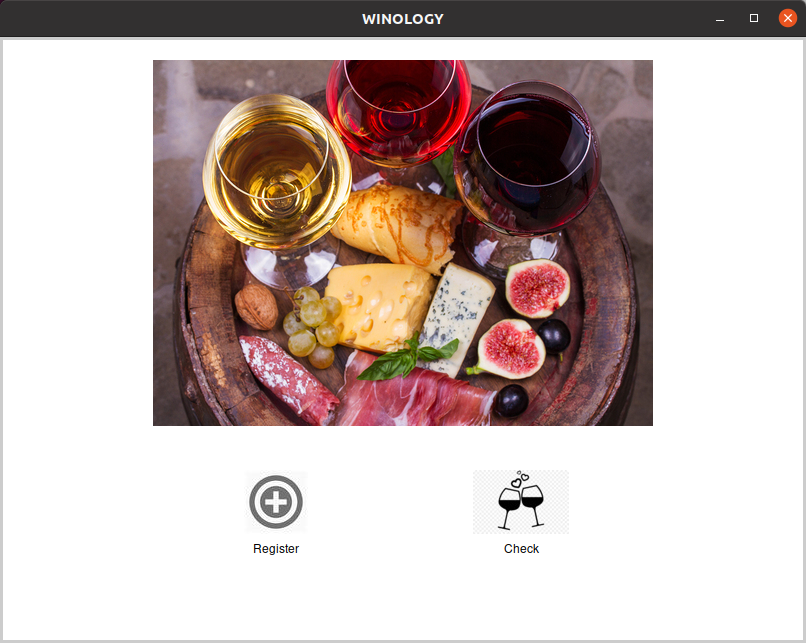
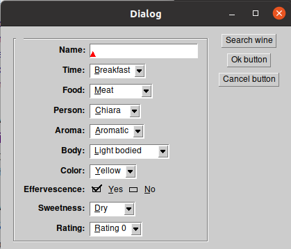
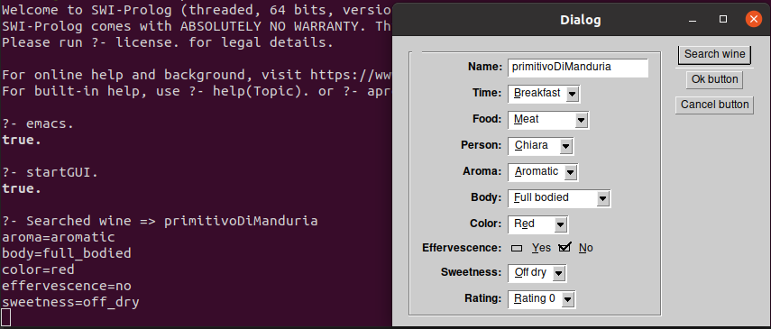
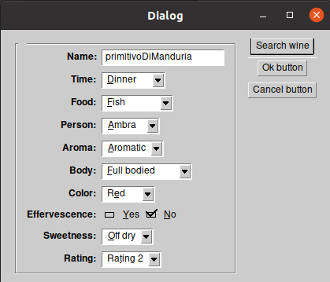
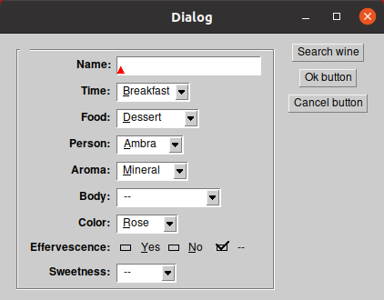
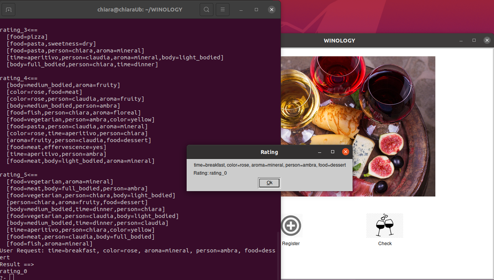

# Winology

Winology is an intelligent tool that can tell you if you would like or not a wine.

## Installation

Clone the repository or download the .zip 

```
git clone https://github.com/LChiara/WINOLOGY
```

## Usage (Docker)
```
docker pull swipl
```
Please note, XPCE is not supported by the swipl docker image: https://hub.docker.com/_/swipl/.
The shell script *docker_run_gui.sh* allowes to start the GUI inside the Docker Container:

```
sh docker_run_gui.sh
```
Please, refer to [Usage (GUI)](#usage-gui), for a description of the Winology interface.
For a more technical description about how to start a GUI in a Docker Container, have a look [here](https://nelkinda.com/blog/xeyes-in-docker/)

## Usage (CommandLine)

Start swipl and load `winology.pl`, that will trigger the learning process. Afterwards the user can register a new entry or start a classification.

```?- consult('D:/WINOLOGY/src/main/prolog/winology.pl').
```

To start a classification
```
? - classify([time=dinner, body=medium_bodied, effervescence=no, aroma=aromatic, food=meat], X).
X = rating_4 .
```
To register a new entry (rating and wine)
```
? - register(rating_2, [time=lunch, food=fish, person=ambra, wine=barolo], barolo, [aroma=mineral, body=light_bodied, color=red, effervescence=no, sweetness=off_dry]).
```
To register just a wine:
```
? - registerWineInDB(barolo, [aroma=mineral, body=light_bodied, color=red, effervescence=no, sweetness=off_dry]).
```
To register just a rating:
```
? - registerRatingInDB(rating_2, [time=lunch, food=fish, person=ambra, wine=barolo]).
```

## Usage (GUI)

Start swipl and load `winologyGUI.pl` to open the GUI
```
?- consult('D:/WINOLOGY/src/main/prolog/winologyGUI.pl').
```

The following window will appear:



The user can now either register add a new entry (*register* button) or classify a wine (*classify* button).
Both buttons open a new popup to insert the desired values:



Each combo box let the user choose one of the possible attributes to describe a new entry (See [How to describe a Wine](#how-to-describe-a-wine)).

If a wine is already present in the DB, all the data can be retrieved using the button *Search Button*. The result of the DB query is printed on the Terminal, as well.



The user can decide to confirm his new entry through the *OK Button* or to come back to the main window, discarding all the changes, by clicking the *Cancel Button*.



To classify a not yet tasted wine or an already known wine with different food, you can use the *Classify Button*. A new popup will be prompt, similar to the one for the registration, but in this case, the user is allowed to leave some field empty. The *Search Button* is available here too.



The *Ok Button* triggers the learning process and then a popup with the resulting rating will be displayed. The result of the learnign process and the classification is printed out in the terminal as well.




## Project structure

    ..
    ├── docs                    # Documentation files
    ├── src                     # Source files
    ├── dockerfile              # Configuration to define the Docker image
    ├── docker_run_gui.sh       # Small bash script to run the Winology GUI inside the Docker container
    └── README.md

### Source files

    ..
    ├── ...
    ├── src
    │   └── main      
    │       ├── prolog
    │       │   ├── backup.pl           # create a backup (.txt file) of the DBs
    │       │   ├── backup.plt          # unit tests of backup.pl
    │       │   ├── characteristics.pl  # attributes description
    │       │   ├── classify.pl         # script to for learn and classification
    │       │   ├── classify.plt        # unit tests for classify.pl
    │       │   ├── constants.pl        # useful constants, such as DB file names
    │       │   ├── gui.pl              # main script for the GUI
    │       │   ├── module_db_rating.pl # module for rating DB
    │       │   ├── module_db_rating.plt # unit tests for module_db_rating.pl
    │       │   ├── module_db_wine.pl   # module for wine DB
    │       │   ├── module_db_wine.plt  # unit tests for module_db_wine.pl
    │       │   ├── register.plt        # script to register a new wine in the DB or a new rating
    │       │   └── winology.pl         # main script to start the learning process and load all the pl files.
    │       └── resources
    └── ...

## How to describe a Wine?

The description can be splitted into two categories, the situation (when, who, which food) and the wine characteristics.

### Situation

```
rating(<rating>, [time=<timeValue>, food=<foodValue>, person=<personName>, wine=<wineName>]).
```

* `rating`: rating_0; rating_1; rating_2; rating_3; rating_4; rating_5.
* `time`: breakfast; lunch; aperitivo; dinner.
* `food`: meat; fish; vegetarian; pasta; pizza; aperitivo; dessert.
* `person`: ambra; chiara; claudia.
* `wine`: name of the wine.

### Wine

```
wineDescription(<wine>, [aroma=<aromaValue>, body=<bodyValue>, color=<colorValue>, effervescence=<effervescenceValue>, sweetness=<sweetnessValue>]).
```

* `aroma`: aromatic; floreal; fruity; mineral.
* `body`: light_bodied; medium_bodied; full_bodied.
* `color`: yellow; rose; red.
* `effervescence`: yes; no.
* `sweetness`: sweet; dry; off_dry.

## HowTo: Add a use the module_db_* databases

The modules module_db_rating and module_db_wine allows the user to populate the DB:

```
% Retrieve all the object in the DB with a specific rating.
?- findall(X, get_rating(rating(rating_0, X)), Objects)

% Register a new entry
?- set_rating(rating(rating_0, [time=breakfast, food=cereals, person=chiara, wine=moscatoDAsti])). 
true.

% Retrieve all the wine facts (already registered in the DB).
?- findall(X, get_wine(wineDescription(X, Y)), Objects).

% Register a new entry in the DB.
?- set_wine(wineDescription(barolo, [aroma=mineral, body=light_bodied, color=red, effervescence=no, sweetness=off_dry])).
true.
```
